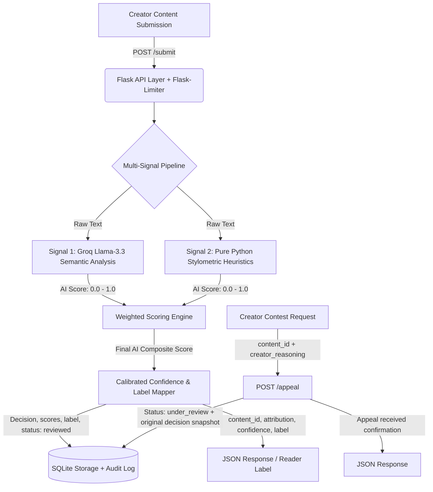

# Provenance Guard Planning Spec

## Architecture

A content submission begins at `POST /submit` with raw text and an optional `creator_id`. Flask-Limiter checks the caller's IP before the text enters the multi-signal pipeline. The semantic and stylometric scores are combined, mapped to a confidence value and one of three labels, then stored atomically with the audit event before the JSON response is returned.

The pipeline executes two independent analyzers:

1. **Semantic Signal (Groq/Llama-3.3):** Evaluates linguistic patterns, structural uniformity, and semantic coherence via an LLM prompt. Returns a probability score (0.0 to 1.0) of being AI-generated.
2. **Stylometric Signal (Pure Python):** Calculates statistical features including sentence length variance and Type-Token Ratio (TTR) for vocabulary diversity. Compares these to typical human/AI baseline distributions to output an AI probability score (0.0 to 1.0).

If a creator disputes a classification, `POST /appeal` receives the content ID and reasoning, changes the stored status to `under_review`, and writes an appeal event containing a snapshot of the original decision and both signal scores. The endpoint then confirms that the appeal is queued for human review.

### Flow Diagram

## Detection Signals and Combination Logic

- **Signal 1 (Semantic):** Uses Groq API with `llama-3.3-70b-versatile` to assess the passage holistically for semantic coherence, generic phrasing, personal grounding, and AI-like uniformity. It returns a float between `0.0` (human-like) and `1.0` (AI-like). This signal can miss carefully edited AI text and can over-score formal or non-native human writing. If Groq is unavailable, the local-development fallback uses personal pronouns, contractions, concrete details, and generic markers; it is intentionally only a deterministic demo substitute.

- **Signal 2 (Stylometric Heuristics):** Pure Python computes Type-Token Ratio and sentence-length variance. Low vocabulary diversity and unusually uniform sentence lengths increase its AI-like score, returned as a float from `0.0` to `1.0`. It is distinct from the semantic signal because it measures structure rather than meaning. It can misclassify short poems, repeated refrains, technical instructions, and other intentionally uniform human writing.

### Combination Formula

The semantic score receives 65% weight because it sees context and meaning, while the noisier length/diversity heuristic receives 35%. The high AI threshold below provides a second safeguard against false accusations:

`Final_AI_Score = (0.65 * Semantic_Score) + (0.35 * Stylometric_Score)`

## Uncertainty Representation and Threshold Policy

The system maps the `Final_AI_Score` (0.0 to 1.0) into three zones. To mitigate false positives (falsely accusing a human), the "Likely AI" threshold is intentionally set high:

**Final AI Score Range** | **Assigned Label** | **Confidence Score Calculation** | **Description**
--- | --- | --- | ---
0.00 to 0.40 | `HUMAN` | `1.0 - Final_AI_Score` (Outputs 0.60 to 1.00) | High probability of human authorship.
Above 0.40 and below 0.75 | `UNCERTAIN` | Scaled between 0.50 and 1.00 within the uncertain band | Signals conflict or sit in an ambiguous middle ground.
0.75 to 1.00 | `AI` | `Final_AI_Score` (Outputs 0.75 to 1.00) | Strong statistical indicators of machine generation.

For example, a final AI score of `0.60` is not treated as 60% proof of AI authorship. It sits inside the uncertain band and communicates that the signals are not decisive. The reported confidence expresses strength within the selected band, while `combined_ai_score` remains available separately for technical inspection.

## Transparency Label Design

The following verbatim text strings will be served back to front-end clients based on the mapping above:

> **High-Confidence Human Label:**
> "Verified Human Author • This text demonstrates the natural variance, structural rhythm, and stylistic fingerprints characteristic of human writing."

> **High-Confidence AI Label:**
> "Automated Content Signature • Our automated system detected strong patterns and uniformities typical of AI generation. Displayed for platform transparency."

> **Uncertain Attribution Label:**
> "Mixed Attributed Signal • Analysis of this text yields ambiguous results. It contains stylistic balances found in both human prose and machine-assisted writing."

## Appeals Workflow and Human Review

- **Who can appeal:** In this prototype, a creator who has the unguessable `content_id` returned by `/submit` can appeal. Production would authenticate the creator and verify ownership; authentication is outside this project's API contract.
- **Payload collected:** `POST /appeal` expects `{"content_id": "UUID", "creator_reasoning": "Text narrative from user"}`.
- **System actions:**
  1. Locates the submission in the SQLite database.
  2. Updates its status from `reviewed` to `under_review`.
  3. Inserts an appeal event containing the timestamp, content excerpt, creator reasoning, original attribution, confidence, and both signal scores in the `audit_log` table.
  4. Returns `appeal_received: true` and the appeal ID.
- **Reviewer View:** A human administrator running `GET /log` sees appeal entries flagged with `status: "under_review"`, with the original excerpt, scores, and creator defense side-by-side.

## Anticipated Edge Cases

1. **The Flash Fiction Short/Poem:** A human-written piece consisting of ultra-short paragraphs or intentional repetitive refrains (e.g., a minimalist poem). The Stylometric Signal will calculate a dangerously low sentence length variance and low TTR, potentially dragging the score into "AI" or "Uncertain" zones.
2. **Technical/API Documentation:** A human writing a tutorial with heavy structural templates (e.g., "Step 1: Install X. Step 2: Run Y."). The highly uniform phrasing will trigger the Semantic Signal's AI flags due to its predictable, instructive nature.

## AI Tool Plan

### Milestone 3: Submission Endpoint & Semantic Signal

- **Sections provided to AI:** `Architecture`, `Detection Signals and Combination Logic` (Signal 1), and the Mermaid diagram.
- **Prompt Request:** Generate a Flask application boilerplate (`app.py`), configure an execution skeleton for `POST /submit`, and build the internal `analyze_semantic(text)` function utilizing the Groq client (`llama-3.3-70b-versatile`) to yield a JSON float.
- **Verification Strategy:** Call the endpoint directly via `curl` with a 500-word human paragraph and check that a single float is parsed and printed cleanly to the console.

### Milestone 4: Stylometric Heuristics & Unified Scoring

- **Sections provided to AI:** `Detection Signals and Combination Logic`, `Uncertainty Representation and Threshold Policy`, and the diagram.
- **Prompt Request:** Write a pure Python styling parser calculating token statistics (no external libraries like NLTK). Integrate this score with the Milestone 3 setup using the 65/35 weighted average formula and return the final numerical mapping.
- **Verification Strategy:** Feed a copy-pasted ChatGPT essay versus a highly erratic personal diary entry; verify that the generated aggregate score shifts distinctly across the 0.40 and 0.75 thresholds.

### Milestone 5: Production Layer (Labels, Appeals, Limiter, Logging)

- **Sections provided to AI:** `Transparency Label Design`, `Appeals Workflow and Human Review`, and the architecture diagram.
- **Prompt Request:** Implement `Flask-Limiter` configurations on endpoints, create an SQLite initialization script to write out audit events, attach label assignment rules, and establish the `POST /appeal` endpoint.
- **Verification Strategy:** Submit inputs that reach all three exact labels, send 12 rapid submissions to confirm ten `200` responses followed by two `429` responses, then appeal a real returned content ID and confirm `GET /log` contains `under_review` plus the reasoning and original scores.
